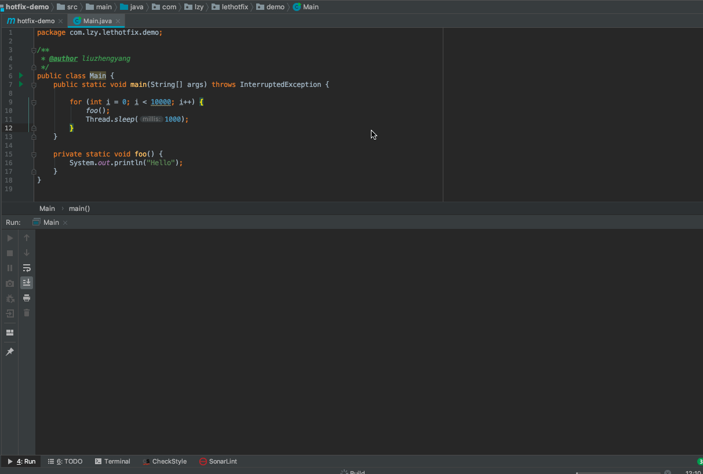

# lets-hotfix

Java代码热更新，让代码修改立即生效。
Class hot reload for java, reload code changes instantly.

## 项目背景

Java是一门静态语言，在使用前需要先编译.java源文件。在Java开发过程中，例如我们在编写一个web项目，修改了一个处理请求的代码逻辑，
如果想让这个修改生效的话，需要重新编译工程，重启web容器，浏览器刷新验证我们的修改是否生效。这样一个迭代循环的耗时包含重新编译的时间、
web容器重启时间、启动后项目初始化时间，这几个时间根据项目的大小从几十秒到十多分钟都有可能。在这样的一个阻塞等待中，开发人员通常会
切换去做其他事情，不停回来检查是否启动完成，这样一个上下文切换的成本也是昂贵的。

因此出现了一些代码热更新工具，比较有名的是jrebel，不过它是收费软件且价格颇高并且不能做定制化开发。

hotreload项目主要解决部署在远程测试机的热更新场景。在很多公司，我们在修改完代码后，需要将代码推送到测试机来测试。这里面的原因可能是本地不方便启动、依赖服务没有
本地测试环境等。通过hotreload可以方便的把更新的class文件同步到远程测试机，并完成热更新。有一些测试环境通常只能通过nginx转发来访问，
hotreload支持代理和自动发现功能，在测试机上部署好hotreload的agent后，就能够注册发现这个机器，通过一个统一的域名即可更新到想要更新的测试机。
hotreload还提供了IDEA插件，在编译完代码后通过快捷键就可以更新服务。

## 使用方法

### 安装

#### 远程安装

### 更新方法体

### 增加字段、方法、类等

## 项目结构

----
